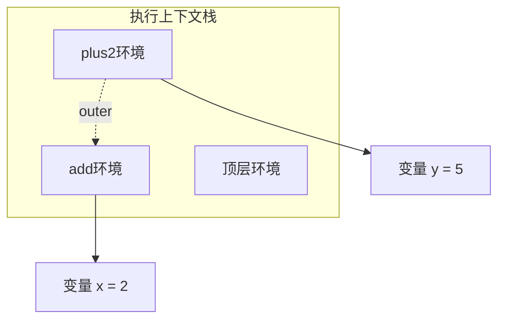

# 4 环境：变量的底层机制

- [4.1 环境：管理变量的数据结构](https://chatgpt.com/c/67c48d33-d2b0-8004-aa1b-03ff0db64b02#41-环境管理变量的数据结构)
- 4.2 通过环境实现递归
  - [4.2.1 代码执行](https://chatgpt.com/c/67c48d33-d2b0-8004-aa1b-03ff0db64b02#421-代码执行)
- 4.3 通过环境实现嵌套作用域
  - [4.3.1 代码执行](https://chatgpt.com/c/67c48d33-d2b0-8004-aa1b-03ff0db64b02#431-代码执行)
- [4.4 闭包与环境](https://chatgpt.com/c/67c48d33-d2b0-8004-aa1b-03ff0db64b02#44-闭包与环境)

在本章中，我们将深入了解 ECMAScript 语言规范如何处理变量。

## 4.1 环境：管理变量的数据结构

**环境(Environment Record)**是 ECMAScript 规范用于管理变量的数据结构。它是一个字典，键是变量名，值是这些变量的值。每个**作用域(scope)**都有其关联的环境。环境必须能够支持与变量相关的以下现象：

- 递归 Recursion
- 嵌套作用域 Nested Scope
- 闭包 Closure

我们将通过示例来说明如何处理每种现象。


## 4.2 通过环境实现递归

首先，我们讨论递归。考虑以下代码：

```javascript
function f(x) {
  return x * 2;
}
function g(y) {
  const tmp = y + 1;
  return f(tmp);
}
assert.equal(g(3), 8);
```

对于每个函数调用，都需要为被调用函数的变量（参数和局部变量）分配新的存储空间。这是通过所谓的**执行上下文栈(execution context stack)**来管理的，该栈引用环境（在本章的上下文中）。环境本身存储在**堆(heap)**上。这是必要的，因为它们有时在执行离开其作用域后仍然存在（我们将在探讨闭包时看到这一点）。因此，它们本身不能通过栈来管理。

### 4.2.1 代码执行

在执行代码时，我们在以下位置暂停：

```javascript
function f(x) {
  // 暂停 3
  return x * 2;
}
function g(y) {
  const tmp = y + 1;
  // 暂停 2
  return f(tmp);
}
// 暂停 1
assert.equal(g(3), 8);
```

具体过程如下：

- **暂停 1** – 调用 `g()` 之前。执行上下文栈有一个条目，指向顶层环境。在该环境中，有两个条目；一个用于 `f()`，一个用于 `g()`。
- **暂停 2** – 执行 `g()` 时。执行上下文栈的顶部指向为 `g()` 创建的环境。该环境包含参数 `y` 和局部变量 `tmp` 的条目。
- **暂停 3** – 执行 `f()` 时。执行上下文的顶部现在指向 `f()` 的环境。

每次遇到 `return` 时，执行上下文栈都会移除一个上下文。

TODO: 补充图片


## 4.3 通过环境实现嵌套作用域

我们使用以下代码来探讨如何通过环境实现嵌套作用域。

```javascript
function f(x) {
  function square() {
    const result = x * x;
    return result;
  }
  return square();
}
assert.equal(f(6), 36);
```

这里，我们有三个嵌套的作用域：顶层作用域、`f()` 的作用域和 `square()` 的作用域。观察如下：

- 这些作用域是相互连接的。内部作用域“继承”外部作用域的所有变量（减去被遮蔽shadowing的变量）。
- 作为一种机制，嵌套作用域独立于递归。后者最好通过独立环境的栈来管理。前者是每个环境与其创建时所处环境之间的关系。

因此，每个作用域的环境通过一个名为 `outer` 的字段指向外围作用域的环境。当我们查找变量的值时，首先在当前环境中搜索其名称，然后在外部环境中搜索，依此类推。整个外部环境链包含所有当前可访问的变量（减去被遮蔽的变量）。

当你进行函数调用时，会创建一个新的环境。该环境的外部环境是函数创建时的环境。为了帮助设置通过函数调用创建的环境的 `outer` 字段，每个函数都有一个名为 `[[Scope]]` 的内部属性，指向其“出生环境”。

### 4.3.1 代码执行

以下是在执行代码时的暂停点：

```
function f(x) {
  function square() {
    const result = x * x;
    // 暂停 3
    return result;
  }
  // 暂停 2
  return square();
}
// 暂停 1
assert.equal(f(6), 36);
```

具体发生的情况如下：

- **暂停 1** – 在调用 `f()` 之前（图 4）。
- **暂停 2** – 在执行 `f()` 期间（图 5）。
- **暂停 3** – 在执行 `square()` 期间（图 6）。

在这些步骤之后，`return` 语句会依次将执行条目从栈中弹出。

**图 4：嵌套作用域，暂停 1 – 调用 `f()` 之前**

```
graph TD
  subgraph 顶层环境
    f[函数 f]
  end
  f -.->|[[Scope]]| 顶层环境
```

顶层环境只有一个条目，即 `f()`。由于 `f()` 的出生环境是顶层环境，因此 `f` 的 `[[Scope]]` 指向顶层环境。

**图 5：嵌套作用域，暂停 2 – 执行 `f()` 期间**

现在，`f(6)` 的函数调用环境已创建。该环境的外部环境是 `f()` 的出生环境（索引 0 处的顶层环境）。可以看到，`outer` 字段被设置为 `f` 的 `[[Scope]]` 的值。此外，新函数 `square()` 的 `[[Scope]]` 也被设置为刚刚创建的 `f` 的环境。

**图 6：嵌套作用域，暂停 3 – 执行 `square()` 期间**

之前的模式再次出现：最新环境的 `outer` 通过我们刚刚调用的函数的 `[[Scope]]` 进行设置。通过 `outer` 形成的作用域链包含当前所有可访问的变量。例如，我们可以访问 `result`、`square` 和 `f`。**环境反映了变量的两个方面。首先，`outer` 作用域链反映了静态作用域的嵌套结构。其次，执行上下文的栈反映了动态函数调用的过程。**


# 4.4 闭包与环境

为了了解环境如何用于实现闭包，我们来看以下示例：

```javascript
function add(x) {
  return (y) => { // (A)
    return x + y;
  };
}
assert.equal(add(3)(1), 4); // (B)
```

这里发生了什么？`add()` 是一个返回函数的函数。当我们在 (B) 行调用 `add(3)(1)` 时，第一个参数传递给 `add()`，第二个参数传递给 `add()` 返回的函数。这能够正常运行的原因是 (A) 行创建的函数在离开其作用域后，仍然保持对其出生作用域的连接。这个连接使得相关的环境仍然存活，并且该函数仍然可以访问该环境中的变量 `x`（`x` 在函数内部是自由变量）。

这种嵌套调用 `add()` 的方式有一个优点：如果只调用 `add()` 的第一层函数，你会得到一个 `x` 参数已被填充的版本：

```javascript
const plus2 = add(2);
assert.equal(plus2(5), 7);
```

将一个具有两个参数的函数转换为两个嵌套的单参数函数的过程称为**柯里化（currying）**。因此，`add()` 是一个柯里化函数。

**仅填充部分参数的函数调用**称为**偏应用（partial application）**（该函数尚未被完全应用）。函数的 `.bind()` 方法执行偏应用。在上面的例子中，我们可以看到，如果一个函数是柯里化的，那么偏应用会变得很简单。

## 4.4.1 代码执行

在执行以下代码时，我们会经历三次暂停：

```javascript
function add(x) {
  return (y) => {
    // 暂停 3：plus2(5)
    return x + y;
  };
} // 暂停 1：add(2)
const plus2 = add(2);
// 暂停 2
assert.equal(plus2(5), 7);
```

具体过程如下：

- **暂停 1** – 在执行 `add(2)` 期间（图 7）。
- **暂停 2** – 在 `add(2)` 执行完成之后（图 8）。
- **暂停 3** – 在执行 `plus2(5)` 期间（图 9）。

**图 7：闭包，暂停 1 – 执行 `add(2)` 期间**

在此阶段，`add()` 返回的函数已经存在（见右下角），并且它通过内部属性 `[[Scope]]` 指向其出生环境。需要注意的是，`plus2` 仍然处于**暂时性死区（Temporal Dead Zone，TDZ）**，尚未初始化。

```mermaid
graph TD
  subgraph 执行上下文栈
    调用帧1((调用帧: add(2)))
    全局环境((全局环境))
  end
  调用帧1 --> x[变量 x = 2]
  调用帧1 -.->|[[Scope]]| 全局环境
  subgraph 函数对象
    add返回的函数((匿名函数))
  end
  add返回的函数 -.->|[[Scope]]| 调用帧1
```

**图 8：闭包，暂停 2 – `add(2)` 执行完成后**

在此阶段，`plus2` 现在指向 `add(2)` 返回的函数。该函数通过 `[[Scope]]` 维持其出生环境（`add(2)` 的环境）的存活。

```mermaid
graph TD
  plus2[函数 plus2] -->|[[Scope]]| add环境
  add环境 --> x[变量 x = 2]
```

**图 9：闭包，暂停 3 – 执行 `plus2(5)` 期间**

在此阶段，`plus2` 的 `[[Scope]]` 被用于设置新环境的 `outer`。这就是当前函数能够访问 `x` 的方式。




```mermaid
graph TD
  subgraph 执行上下文栈
    调用帧1((调用帧: add(2)))
    全局环境((全局环境))
  end
  调用帧1 --> x[变量 x = 2]
  调用帧1 -.->|[[Scope]]| 全局环境
  subgraph 函数对象
    add返回的函数((匿名函数))
  end
  add返回的函数 -.->|[[Scope]]| 调用帧1
```


## 参考

- 本文主要参考了 Exploringjs 网站的 Deep JS 一书 https://exploringjs.com/deep-js/ch_environments.html
- 图片中的 Lexical Environment 是执行上下文的一个属性，见 https://tc39.es/ecma262/#table-additional-state-components-for-ecmascript-code-execution-contexts

Table 26: Additional State Components for ECMAScript Code Execution Contexts

| Component           | Purpose                                                      |
| ------------------- | ------------------------------------------------------------ |
| LexicalEnvironment  | Identifies the [Environment Record](https://tc39.es/ecma262/#sec-environment-records) used to resolve identifier references made by code within this [execution context](https://tc39.es/ecma262/#sec-execution-contexts). |
| VariableEnvironment | Identifies the [Environment Record](https://tc39.es/ecma262/#sec-environment-records) that holds bindings created by [VariableStatement](https://tc39.es/ecma262/#prod-VariableStatement)s within this [execution context](https://tc39.es/ecma262/#sec-execution-contexts). |
| PrivateEnvironment  | Identifies the [PrivateEnvironment Record](https://tc39.es/ecma262/#privateenvironment-record) that holds [Private Names](https://tc39.es/ecma262/#sec-private-names) created by [ClassElement](https://tc39.es/ecma262/#prod-ClassElement)s in the nearest containing class. null if there is no containing class. |

- 执行上下文的 Lexical Environment 指向的对象是一个 Environment Record，它有一个属性 `[[outerEnv]]` 指向外层的环境（对于 Global Environment Record 它是 null）

> Every Environment Record has an [[OuterEnv]] field, which is either null or a reference to an outer Environment Record. This is used to model the logical nesting of Environment Record values. The outer reference of an (inner) Environment Record is a reference to the Environment Record that logically surrounds the inner Environment Record. 
>
> Environment Records are purely specification mechanisms and need not correspond to any specific artefact of an ECMAScript implementation.

- 